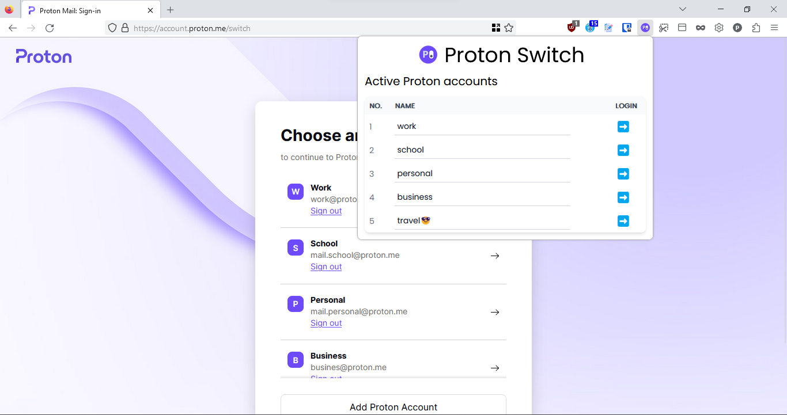
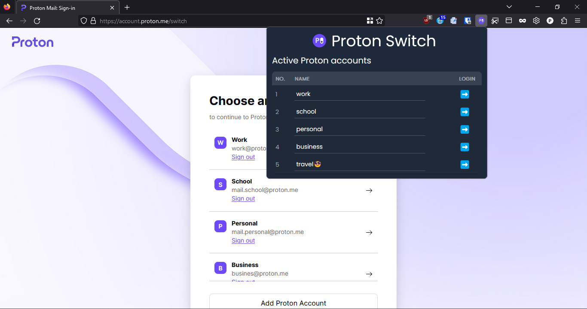
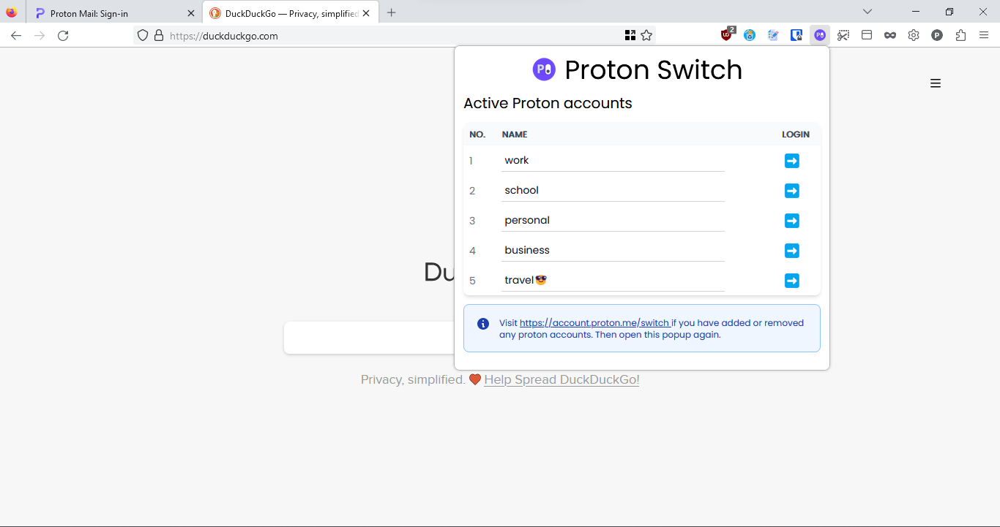

# Proton Switch 📨

Proton Switch is a Firefox extension that simplifies the process of switching between multiple ProtonMail accounts. With Proton Switch, you can quickly and easily access and switch between your ProtonMail accounts without having to go to the ProtonMail switch page every time. This extension provides a more efficient and streamlined process for managing multiple ProtonMail accounts.
Features

- Quick access to multiple ProtonMail accounts
- Saves time and effort by eliminating the need to visit the ProtonMail switch page
- Simple and intuitive interface
- Open source
- Faster than Proton's solution 🚀

## How to Use

- [Install](https://addons.mozilla.org/en-US/firefox/addon/proton-switch) the extension from the Firefox Add-ons store.
- Visit [Proton switch page](https://account.proton.me/switch) and open the extension popup to add your accounts. (This is a one-time process. You only need to do this if you add or remove accounts later)
- Click on the Proton Switch icon in your browser toolbar. Tip: Pin the extension to your toolbar for easy access.
- Choose the account you want to switch to and voila you are done!

## Screenshots

Switch between multiple ProtonMail accounts with ease ➡️

Supports both light and dark themes 🌗

Switch from any page on the web 🌐

## Contributing

This extension is open source and contributions are welcome. Feel free to submit bug reports or pull requests on the GitHub repository.

## License

Do whatever you want :P

## PS

This extension was inspired by the need for a faster and more efficient way to switch between multiple ProtonMail accounts. Thank you to the ProtonMail team for providing a secure and reliable email service.
